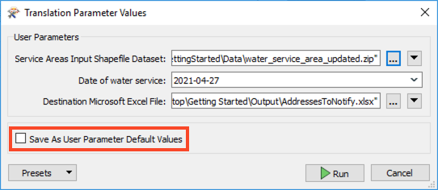

<head><base target="_blank"> </head>

#### 1\. Open FME Workbench
Continue with the workspace from the previous exercise in FME Workbench. Alternatively, open the template `C:\FMEData2022\Resources\GettingStarted\Workspaces\GettingStarted-WriteData-Begin.fmwt` in FME Workbench.

#### 2\. Open the Parameter Manager

In the *Navigator window*, right-click on **User Parameters** and select **Manage User Parameters**.\

The *Parameter Manager* contains all of the user parameters set up in a workspace. This workspace only has the default parameters that are set up when a reader and writer are added. Since we want to provide the user an option to upload a new water_service_area file, we should clean these parameters up.  For more information on the Parameter Manager, see [this article](https://community.safe.com/s/article/Using-the-Parameter-Manager).\

#### 3\. Remove Parameter
First, let's remove the Source CSV parameter. Click on the **Source CSV** parameter on the left-hand side and click on the trash icon at the top.\

After removing the CSV parameter, let's modify the Source Esri Shapefile parameter so it is easier for the user to know which file to upload.

#### 4\. Modify Source Parameter
Select the **Source Esri Shapefile** parameter, then on the right-hand side, edit the Prompt to read:\
`Service Areas Input Shapefile Dataset`\

#### 5\. Create New Parameter
While we're in the Parameter Manager, let's create a parameter for the date of service. This will be set by the user when the workspace is run and will be attached to the customers to notify the output spreadsheet.\
Click on the green plus sign in the top left, and then select **DateTime**.\

Then on the right-hand side, enter the following parameter properties:

-   Parameter Identifier: `SERVICE_DATE`
-   Prompt: `Date of water service`
-   Published: `Enabled`
-   Required: `Enabled`
-   Disable Attribute Assignment: `Enabled`
-   Time Format: `Date Only`

Click **OK** to finish with the Parameter Manager.

#### 6\. Modify Shapefile Reader
Since we won't know if the filename of the updated file will be different, let's change our shapefile reader to accept all filenames with the same schema.\
Double-click on the **water_service_area** reader feature type to open the parameters. In the parameters, enable Merge Feature Type and leave the other parameters set at the default, then click **OK**.\

#### 7. Link Published Parameter to Service Date Attribute
Now that we have a SERVICE_DATE parameter, we need to create an attribute to utilize it in the workspace. Open the **AttributeManager** transformer, and add a new *Output Attribute* called `SERVICE_DATE`. Then for the *AttributeValue*, click on the box to expose the drop-down arrow then select **User Parameter > SERVICE_DATE**.\

#### 8\. Run the Workspace
If you run the workspace immediately, it will use the original input Shapefile. However, if you select **Prompt for User Parameters** from the drop-down next to *Run* then click **Run**, you will be prompted to choose the input file, as well as a service date.\

In the Translation Parameter Values dialog that appears when the workspace is run, browse to the updated `water_service_area_updated.zip`,  which is in the `C:\FMEData2022\Resources\GettingStarted\Data` folder. This zip file contains all of the sidecar shapefile files and has a new service area that customers will have to be notified about. In the File Browser, change the Shapefiles (`*.shp`) drop-down to **All File(s)** to see the zip file.

Then set the Date of Water ServiceService Date to some time within the next week. Finally, before clicking Run, uncheck the **Save As User Parameter Default Values**. Ignore the Destination Microsoft Excel File, we can leave it as the default for now. We don't want these to be saved as the default because this is just a test run to ensure the workspace is working correctly.\

#### 9\. Publish to FME Server
Now that we have the parameters set up and confirmed that the workspace runs correctly, we can publish it to FME Server.\
Before publishing, save the workspace. Once saved, go to **File > Publish to FME Server** on the top menu bar.\
Connect to the same connection as the previous tutorial. Select the Server Tutorial repository that we also created in the previous tutorial. We will keep the workspace name `AddressesToNotify.fmw` and just overwrite the previously uploaded workspace.

#### 10\. Open the FME Server Web Interface
Open and log into the *FME Server Web User Interface*.

#### 11\. Upload Updated File
When we run the workspace in FME Server we have the option to upload the updated shapefile directly through our published parameter, the only issue with this method is that it gets uploaded to the Temporary files folder, which gets purged daily. We want to reference this in an Automation we will set up in the [next tutorial](https://community.safe.com/s/article/schedule-a-workspace-to-run-with-fme-server), so let's upload it to the permanent *Data* folder.\
On the side menu bar, expand **Files & Connections**, then click on **Resources**.\

[Resources](https://docs.safe.com/fme/html/FME_Server_Documentation/WebUI/Resources.htm) are where files are stored such as log files, temp files, connections, and backup files. The Data folder is where users can store data outside of repositories to be used across FME Server. Open the **Data** Folder (1), then click **New** in the top corner (2). Create a new folder called `Server Training` (3), then click **OK**.\

Open the new *Server Training* folder, and click on **Upload > Files**. Then select `water_service_area_updated.zip`, and click **OK**. Now, this file can be accessed anywhere in FME Server.\

#### 12\. Run Workspace
On the side menu bar in FME Server, click on **Run Workspace**. On the Run Workspace page, select **Server Tutorial** for the *Repository* and the **AddressesToNotify.fmw** workspace. Select **Data Download** for the *Service*.\
Check out the *Published Parameters*. The two parameters that were set up and just tested in FME Workbench are shown. Click on the **Browse Resources** button for the *Service Area* parameter.\

This brings up the *Resource* browser. Here you could upload a temporary file if you are testing a workspace, but since we uploaded a file in the previous step we can select it here. Click on the **Data** folder to open it, then **Server Training**, then select the **green plus sign** next to the *water_service_area_update.zip*. You may need to remove the *$(FME_MR_DIR)water_service_area.shp* file first.

Anytime you click on the green plus sign the items will appear under the *Selected Items* section, this allows you to choose files from different folders. Click **OK** once the file is selected.\

Note: If you are working with shapefiles that are not contained in a zip file, or any other file types that contain sidecar files, be sure to select ALL of the files when adding them to a parameter or workspace. If you are missing a file, the workspace won't run correctly.\
Finally, set the *Date of water service* to any date, then click **Run**.\

Files stored within FME Server will have $(FME_SHAREDRESOURCE_<root folder>) in front of the path.

#### 13\. View the Results
The Data Download service presents a URL link to the translation results in a zip file. A quick inspection of the contents of the zip file confirms the results are what we expected.\

#### 14. Click "Next"
