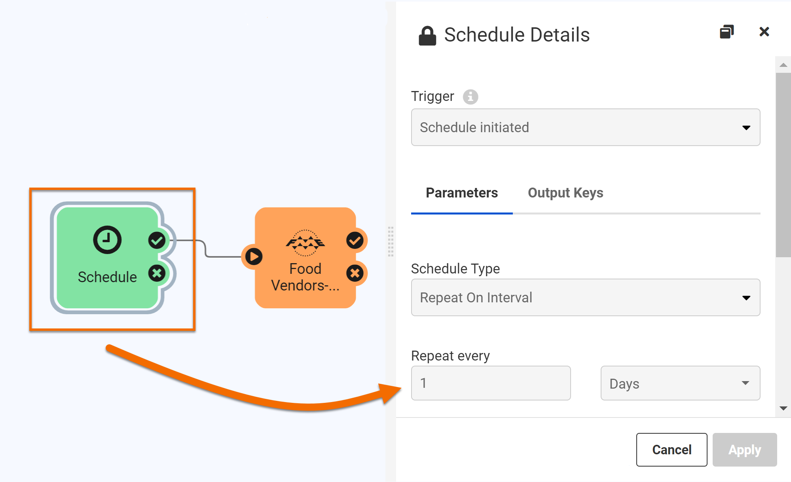

<head><base target="_blank"> </head>

#### 1. Open an Automation

In the FME Server web interface, click Automations > Manage Automations on the left navigation panel.

#### 2. View Automation Configuration

This Automation has a Schedule Trigger that causes it to run once day. You can see how this is configured by double-clicking the Schedule object on the canvas to open the Details pane. You can see it is set to run once a day. You cannot edit this Automation because it is currently running.

After the Trigger activates, it runs the FoodVendors workspace. Double-click the orange Run a Workspace Action to view the Details pane. It shows the parameters being used to run the workspace. It is writing the data to an FME Server Data folder.

#### 3. Manually Trigger the Automation

So we don't have to sit around waiting, double-click the Schedule again and then click the Trigger button in the bottom right. This button lets you manually trigger Automations for testing.

#### 4. View Triggered Jobs

Congratulations! You built an FME workspace and learned about creating data integration automations using FME Server.
