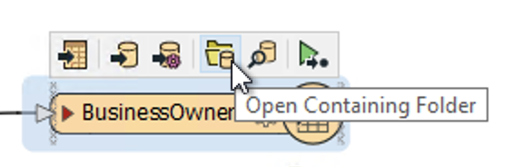

<head><base target="_blank"> </head>

#### 1. Follow Sven's Steps
Continue with the previous exercise's workspace or open C:\FMEData2021\Workspaces\IntegrateDataWithTheFMEPlatform\bring-together-multiple-streams.fmw

Make sure you have followed along with [Sven’s steps](https://safe.my.trailhead.com/content/safe/modules/connect-to-data/bring-together-multiple-streams).

#### 2. Locate Your Output Data
Select the BusinessOwners writer feature type and then click the **Open Containing Folder** icon. This opens the C:\FMEData2021\Output\Training folder where the data was written.

#### 3. Challenge
Complete the [Challenge](https://safe.my.trailhead.com/content/safe/modules/connect-to-data/bring-together-multiple-streams#challenge).

#### 4. Click "Next"
