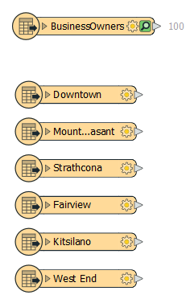

<head><base target="_blank"> </head>

#### 1. Follow Sven's Steps
Keep in mind that your source data can either be copy-pasted from https://s3.amazonaws.com/FMEData/FMEData2021/Data/Planning/BusinessOwners.xlsx or you can use C:\FMEData2021\Data\Planning\BusinessOwners.xlsx on the lab machine.

Recreate what Sven has done by following the instructions [here](https://safe.my.trailhead.com/en/content/safe/modules/connect-to-data/connect-and-view-data).

#### 2. Add Public Art to Workspaces
An Excel spreadsheet containing public art can be found at C:\FMEData2021\Data\Culture\PublicArt.xlsx

Add another Excel reader to connect to all the sheets (feature types) in this public art Excel workbook.

The workbook contains one sheet per neighborhood. Each row is a public art installation and contains information about the location, the title of the piece, and its longitude and latitude.  

Your canvas should now look like the image below:

#### 3. Challenge
Complete the [Connect and View Data Challenge quiz](https://safe.my.trailhead.com/content/safe/modules/connect-to-data/connect-and-view-data#challenge).

#### 4. Click "Next"
