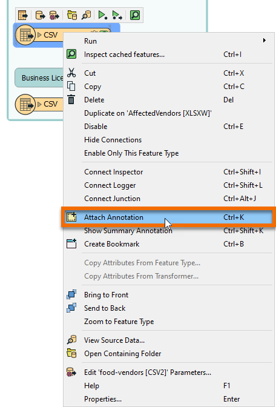

1. Add Annotation

Right-click the food vendors CSV reader feature type and choose Attach Annotation.

Type in "Food Vendors." Click elsewhere to finish editing the Annotation.

2. Save Your Workspace

Click File > Save to save your workspace now that you have made a change.

3. Continue to Next Exercise

Click the Next button below.
