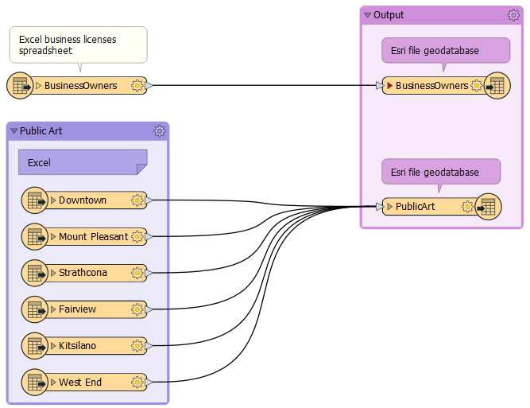

<head><base target="_blank"> </head>

#### 1. Follow Sven's Steps
Continue with the previous exercise's workspace or open C:\FMEData2021\Workspaces\IntegrateDataWithTheFMEPlatform\document-your-workspace.fmw

Make sure you have followed along with [Sven’s steps](https://safe.my.trailhead.com/content/safe/modules/connect-to-data/document-your-workspace).

Your updated workspace should similar to this:

#### 2. Challenge
Complete the [Challenge](https://safe.my.trailhead.com/content/safe/modules/connect-to-data/document-your-workspace#challenge).

#### 3. Click "Next"
