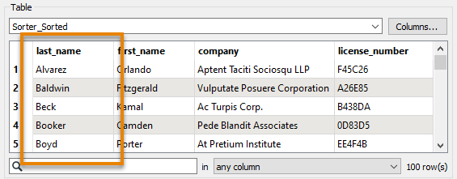

<head><base target="_blank"> </head>

#### 1. Follow Jennifer's Steps
Open the starting workspace, C:\FMEData2021\Workspaces\IntegrateDataWithTheFMEPlatform\find-the-right-transformer.fmw

The optional example workspace can be found at C:\FMEData2021\Workspaces\IntegrateDataWithTheFMEPlatform\find-the-right-transformer-example.fmw

Make sure you have reviewed [Jennifer’s steps](https://safe.my.trailhead.com/content/safe/modules/transform-data/find-the-right-transformer).

#### 2. Now it’s your turn!
Using the techniques Jennifer used and the starting workspace, try to find a transformer that will order your features in ascending alphabetical order by "last_name". Once you find it, connect it between the **GeometryFilter** and the **BusinessOwners** feature type and use it to order your features. You can use **Visual Preview** with feature caching to confirm the features are in the right order. Your output should look like this:

#### 3. Challenge
Complete the [Challenge](https://safe.my.trailhead.com/content/safe/modules/transform-data/find-the-right-transformer#challenge).

#### 4. Click "Next"
