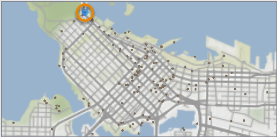

<head><base target="_blank"> </head>

#### 1. Follow Sven's Steps
Continue with the previous exercise's workspace or open C:\FMEData2021\Workspaces\IntegrateDataWithTheFMEPlatform\interactively-view-spatial-data.fmw

Make sure you have followed along with [Sven’s steps](https://safe.my.trailhead.com/content/safe/modules/connect-to-data/interactively-view-spatial-data).

#### 2. Find Northermost Public Art Installation
Use **Pan** and **Zoom** to find the northernmost public art installation. Use **Select** to select it.

Use the *Table View* or *Feature Information* to take note of the title of the installation.

*Map tiles by [Stamen Design](https://stamen.com/), under [CC BY 3.0](http://creativecommons.org/licenses/by/3.0). Data by [OpenStreetMap](http://openstreetmap.org/), under [CC BY SA](http://creativecommons.org/licenses/by-sa/3.0).*

#### 3. Challenge
Complete the [Challenge](https://safe.my.trailhead.com/content/safe/modules/connect-to-data/interactively-view-spatial-data#challenge).

#### 4. Click "Next"
