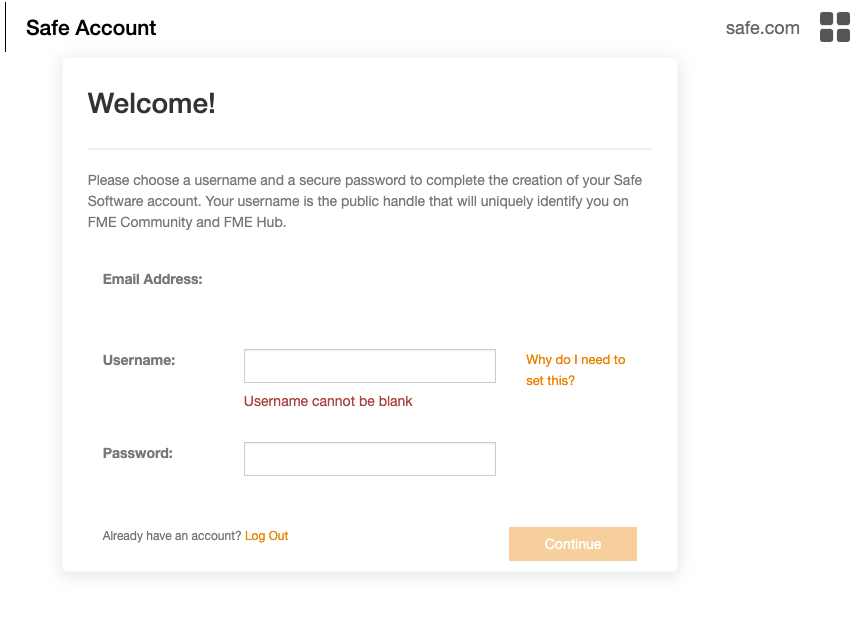

<head><base target="_blank"> </head>

#### 1. Go to the [Integrate Data with the FME Platform](https://safe.my.trailhead.com/en/content/safe/trails/integrate-data-with-the-fme-platform) trail.
Click [here](https://safe.my.trailhead.com/en/content/safe/trails/integrate-data-with-the-fme-platform) to go to the Integrate Data with the FME Platform trail. The FME Academy will open in a new tab in your browser.
If you have already logged in to your FME Academy account, you will be taken directly to the trail. If not, you will have to log in or sign up first.

#### 2. Log In
If you have not already logged in to your FME Academy account, you will see this:

If you already have an FME Academy account, Log In, and you will be taken to the [Integrate Data with the FME Platform](https://safe.my.trailhead.com/en/content/safe/trails/integrate-data-with-the-fme-platform) trail.

#### 3. Sign Up
If you do not already have an FME Academy account, click on Sign Up\

You will then be taken to the Safe Account page to finalize your account settings\

Enter your desired username and confirm your password, then click *Continue* to be taken to the [Integrate Data with the FME Platform](https://safe.my.trailhead.com/en/content/safe/trails/integrate-data-with-the-fme-platform) trail.

#### 4. Click "Next"
