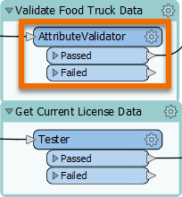
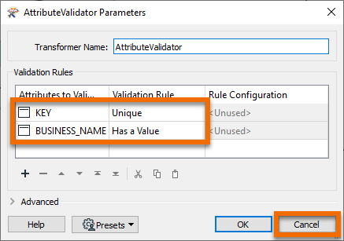
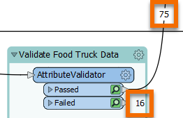

**Step 1**

Find the AttributeValidator in the "Validate Food Truck Data" bookmark to the right of the reader feature types. Note that it uses the food vendor data as its input.

**Step 2**

Double-click the AttributeValidator to view its parameters in a dialog.

Like the rest of the transformers in this workspace, it is already configured. This transformer tests features to ensure each has a unique value for `KEY` and has a value for `BUSINESS_NAME`. Click Cancel to close the dialog without making changes.

**Step 3**

You should notice that the feature counts show how the data has been split into two streams by the AttributeValidator. 16 features come out of the Failed port (they did not meet the validation rules), while 75 come out of the Passed port and continue on to be written.

**Step 4**

Click the Next button below.
