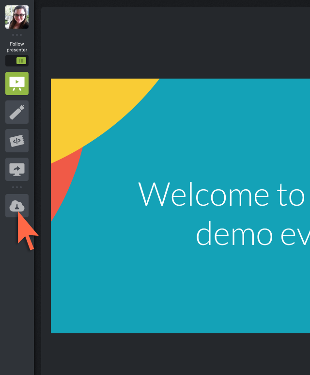

<head><base target="_blank"> </head>

#### 1. Open Workbench
When you first open workbench in your lab, it will take approximately 1 minute to finish loading. Please be patient.
Subsequent launches of Workbench will be much faster.

Click on the Workbench icon in the Taskbar   
or go to Start|FME Desktop|FME Workbench.  

#### 2. Play with the Zoom
Click on the lab icon  
  
Then use the following keyboard shortcuts to zoom in and out.
- Windows: Press Ctrl and - or +
- Mac: Press ⌘ and - or +
- Chrome OS: Press Ctrl and - or +

#### 3. Click "Next"
