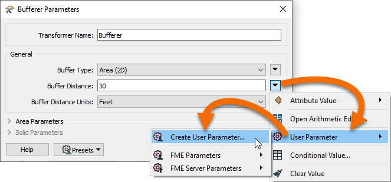
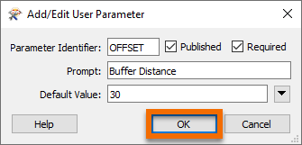
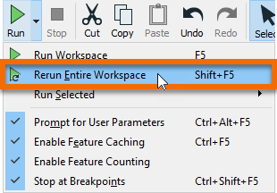
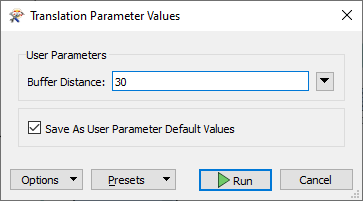
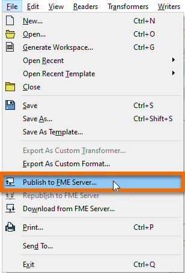
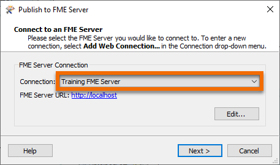
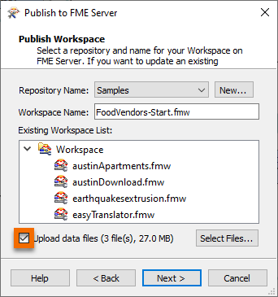
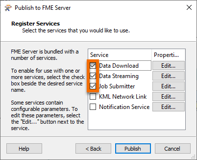

**Step 1**

Double-click the Bufferer to view its parameters.

Find the General > Buffer Distance parameter near top. Click the drop-down arrow, then User Parameters > Create User Parameter.

Click OK to create the parameter with default settings.

Click OK again to close the transformer dialog.

**Step 2**

Click the drop-down arrow next to the Run button to access the Run menu. Click Rerun Entire Workspace.

You should see a Translation Parameter Values dialog pop up. Here, the user running the workspace can choose how much of a buffer distance to use. You can test running it with a different buffer distance, or click Cancel.

**Step 2**

Click File > Publish to FME Server.

Click the Connection drop-down and select the Training FME Server. Click Next.

Check Upload data files and click Next.

Make sure Data Download, Data Streaming, and Job Submitter are checked. Click Publish.

The workspace is published to FME Server. Look at your Translation log to find the URL to the published workspace. It will say something like:

`Direct Link         : http://localhost/fmeserver/#/workspaces/run/Training/FoodVendors.fmw`

Click the link to open the FME Server web interface.

**Step 3**

Your browser should have auto-saved your FME Server credentials. If not, please enter them and click Login:

| Username | Password     |
|----------|--------------|
| admin    | FMElearnings |

**Step 4**

When you run a workspace on FME Server, you are presented with the same options as on Desktop. We can keep the default values for all the source data.

Enter 35 for Buffer Distance.

Click Run.

IMAGE

The workspace will run on FME Server and you will be presented with a Data Download URL. Click the link and extract it to view the Excel data.

**Step 5**

Click the Next button below.
