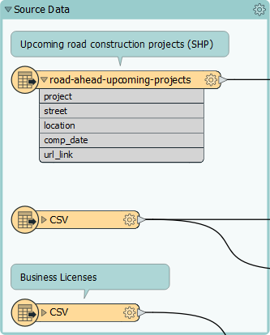
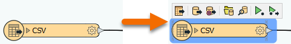
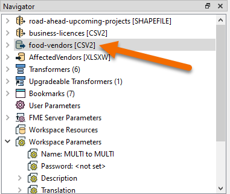
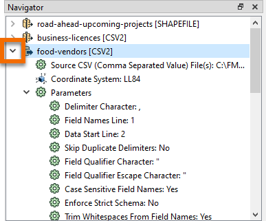
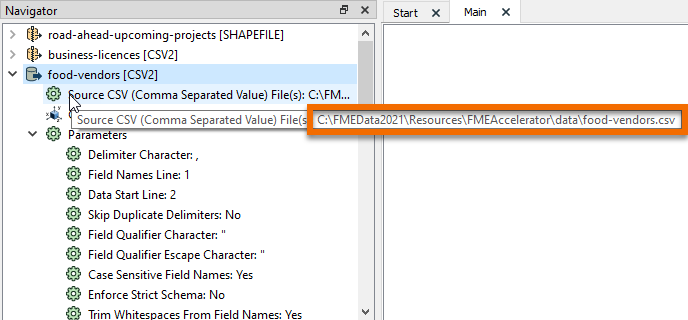

<head><base target="_blank"> </head>

#### 1. Confirm FME Workbench Is Open

You should see an FME Workbench window with the workspace `C:\FMEData2022\Resources\FMEAccelerator\FoodVendors-Start.fmw` loaded.

#### 2. Examine Workspace

Explore the workspace.

Three existing reader feature types (data sources) are on the left: upcoming road construction projects and business licenses are labelled. A third unlabeled CSV reader feature type is on the canvas.

The bookmarks (containers) and annotation (comments) containing comments about what step will take place where. The blue objects in the middle of the workspace are the transformers we will use to build our workspace. They are already configured and connected for the sake of speed.

#### 3. Examine a CSV Reader

One of the CSV reader feature types is not annotated with "Business Licenses." Let's figure out what data it is reading.

Click it once to select it. It will be highlighted in blue to show it is selected.

When you select it, its reader in the Navigator window will also be highlighted in gray: food-vendors [CSV2].

Click the right-pointing arrow next to the reader in the Navigator to expand its parameters.

The Source CSV (Comma Separated Value) File(s) parameter tells us this CSV reader is using data located at `C:\FMEData2021\Resources\FMEAccelerator\data\food-vendors.csv`. We'll add annotation to the feature type later so it's clearer what data we are using.

#### 4. Continue to Next Exercise

Click the Next button below.
