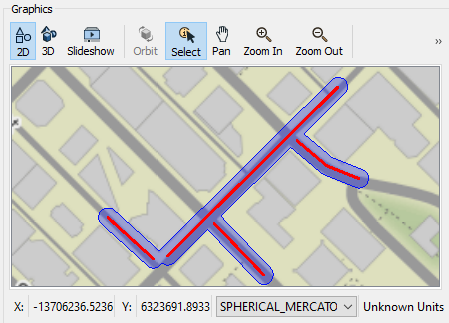
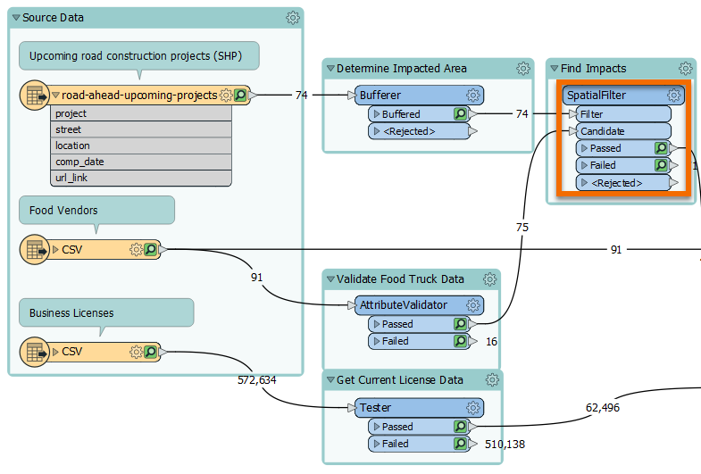
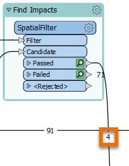
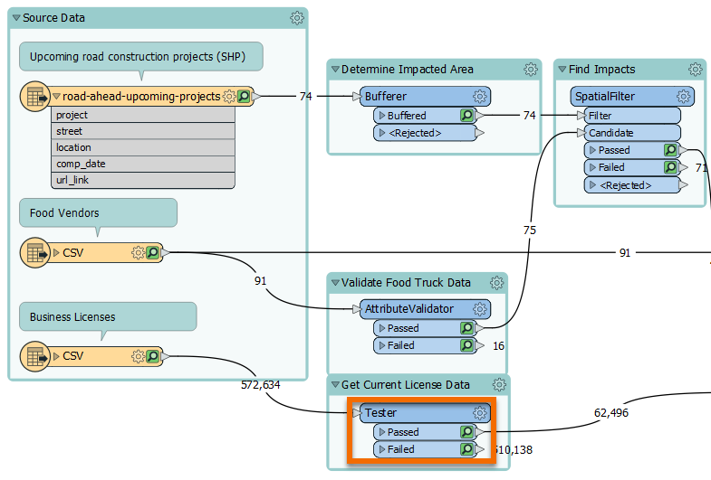
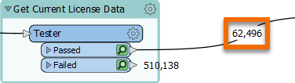
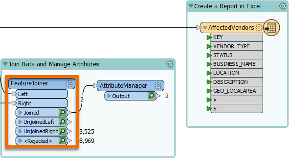
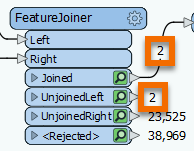
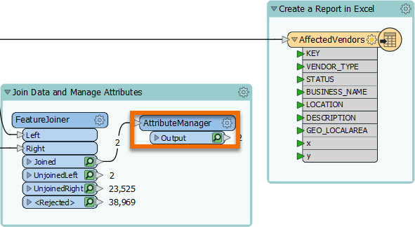
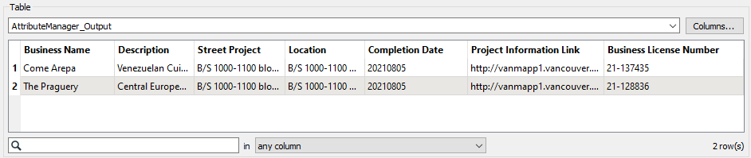
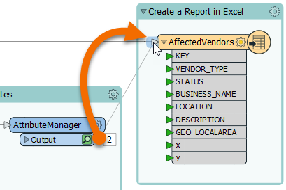

**Step 1**

Find the Bufferer transformer in the "Determine Impacted Area" bookmark.

**Step 2**

The Bufferer is configured to create features representing the areas within 30 feet of the road centerline, i.e., areas impacted by construction.

Inspect the Bufferer's Buffered port feature cache. If you zoom in, you will see the lines have been buffered into polygons.

**Step 3**

Find the SpatialFilter transformer in the "Find Impacts" bookmark.

**Step 4**

The SpatialFilter is configured to find food vendors within the buffered areas.

Observe the feature counts for the SpatialFilter's Passed port. Four food vendors will be affected by the road construction.

**Step 5**

Find the Tester in the Get Current License Data bookmark.

**Step 6**

The Tester is configured to filter out business licenses that are not valid for the year 2021.

Observe the Tester's feature counts. 62,496 licenses are valid for 2021 (the Passed port). We will use these features and leave the remaining features in the Failed port, filtering them out of our data.

**Step 7**

Find the FeatureJoiner in the "Join Data and Manage Attributes" bookmark.

**Step 8**

The FeatureJoiner is configured to join the business license data to the food vendor data.

Based on the feature counts for the FeatureJoiner, you should be able to see that two of the affected vendors had matching valid license data found, so they came out of the Joined port. Two did not have a valid license, so they came out of the UnjoinedLeft port. These businesses in the food vendor are actually out of business, so they are filtered out of the data.

**Step 9**

Find the AttributeManager on the right side of the "Join Data and Manage Attributes" bookmark, next to the FeatureJoiner.

**Step 10**

The AttributeManager is configured to rename a few attributes and remove unnecessary attributes we don't want in our final dataset.

If you compare the FeatureJoiner's Joined port cache to the AttributeManager's Output port cache, you will see how the attributes have changed.

**Step 11**

Delete the connection between the AttributeValidator and the writer feature type by right-clicking it and choosing Delete.

Add a new connection line between the AttributeManager's Output port and the AffectedVendors writer feature type by clicking and dragging from the right-pointing gray triangle on the Output port to the right-pointing gray triangle on AffectedVendors. Let go to make the connection.

**Step 12**

The final step is to write the data to Excel. Run the workspace to write the data.

To confirm the data was written successfully you can refer to the Translation Log (the last line should report `Translation was SUCCESSFUL`). You can also find the output data by clicking the writer feature type once to select it, then clicking the Open Containing Folder button that appears in the small toolbar above to find the Excel file. You can open it in Open Office if you want to confirm it was written correctly.

**Step 13**

Click the Next button below.
