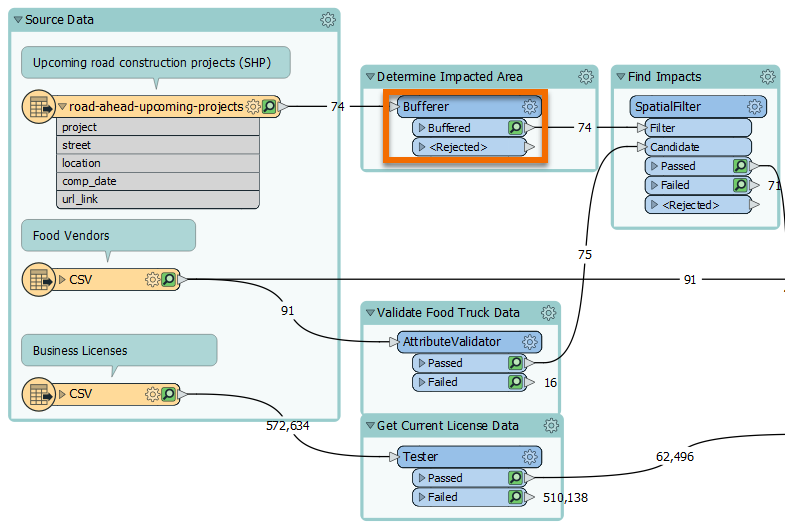

<head><base target="_blank"> </head>

#### 1. Perform Spatial Analysis (Spatial Join)

Find the Bufferer transformer in the "Determine Impacted Area" bookmark.

**Step 2**

The Bufferer is configured to create features representing the areas within 30 feet of the road centerline, i.e., areas impacted by construction.

Inspect the Bufferer's Buffered port feature cache. If you zoom in, you will see the lines have been buffered into polygons.

Next, we need to find which food vendor points intersect (or overlay) the affected construction zones. We can use the SpatialFilter transformer for this job. We have  configured the SpatialFilter to find intersecting features.

Observe the feature counts for the SpatialFilter's Passed port. Four food vendors will be affected by the road construction.

#### 2. Perform an Attribute-Based Filter

For the remaining steps, we'll just quickly look at each transformer for the sake of time.

The next step we want to accomplish is to enrich our spatial data with tabular data from another source. We use the FeatureJoiner to join business license data to the affected food vendors, enriching our spatial data with an external tabular data source.

Before joining, we should make sure we are only using current business licenses.

We can do this using the Tester transformer, which lets us conduct simple pass/fail logical tests on features to filter them. It filters out invalid features.

#### 3. Perform an Attribute-Based Join

Now that we have impacted food vendors and a list of current business licenses, we can join this data together to add business license data to the impacted vendors using the FeatureJoiner.

Based on the feature counts for the FeatureJoiner, you should be able to see that two of the affected vendors had matching valid license data found, so they came out of the Joined port. Two did not have a valid license, so they came out of the UnjoinedLeft port. These two vendors are actually out of business, despite our source food vendor data claiming they are open. We do not need to alert an out-of-business food vendor, so it is OK that these two features will be filtered out of our data.

#### 4. Manage Attributes

The final step before we write out our data to create an Excel file of business to alert is to clean up our Attributes. We will use an AttributeManager to rename and remove some attributes. This transformer removes many unnecessary attributes and renames a few others.

#### 5. Clean Up Connection Lines

Delete the connection between the AttributeValidator and the writer feature type by right-clicking it and choosing Delete.

Add a new connection line between the AttributeManager's Output port and the AffectedVendors writer feature type by clicking and dragging from the right-pointing gray triangle on the Output port to the right-pointing gray triangle on AffectedVendors. Let go to make the connection.

#### 6. Write the Data

The final step is to write the data to Excel. Run the workspace to write the data.

To confirm the data was written successfully you can refer to the Translation Log (the last line should report `Translation was SUCCESSFUL`). You can also find the output data by clicking the writer feature type once to select it, then clicking the Open Containing Folder button that appears in the small toolbar above to find the Excel file. You can open it in Open Office (just click Next on the prompt until it opens) if you want to confirm it was written correctly.

#### 7. Continue to Next Exercise

Click the Next button below.
