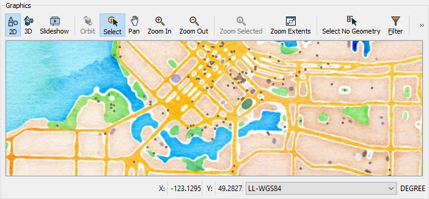

<head><base target="_blank"> </head>

#### 1. Follow Sven's Steps
Continue with the previous exercise's workspace or open C:\FMEData2022\Workspaces\IntegrateDataWithTheFMEPlatform\view-data-with-a-background-map.fmw

Make sure you have followed along with [Sven’s steps](https://safe.my.trailhead.com/content/safe/modules/connect-to-data/view-data-with-a-background-map).

#### 2. Swap to a Different Stamen Maps Background Map
If you haven't already done so, swap to a different Stamen Maps background map using the “watercolor” layer instead of the “terrain” layer. Your map should look like this:

*Map tiles by [Stamen Design](https://stamen.com/), under [CC BY 3.0](http://creativecommons.org/licenses/by/3.0). Data by [OpenStreetMap](http://openstreetmap.org/), under [CC BY SA](http://creativecommons.org/licenses/by-sa/3.0).*

#### 3. Challenge
Complete the [Challenge](https://safe.my.trailhead.com/content/safe/modules/connect-to-data/view-data-with-a-background-map#challenge).

#### 4. Click "Next"
