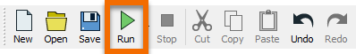
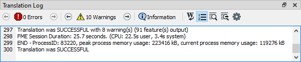
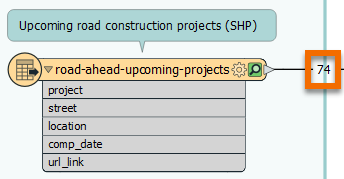
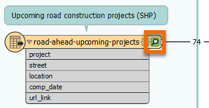
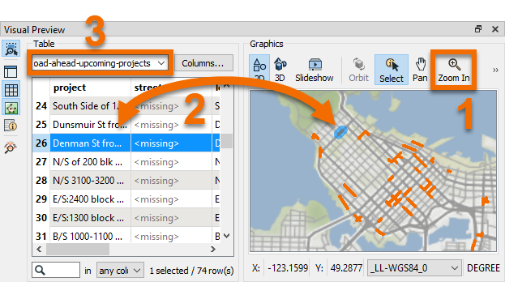

**Step 1**

Click the green "play" button on the Toolbar, the Run button, to run your workspace.

When you click Run the Translation Log appears and informs you of the results of running the workspace. This log lets you view any warnings or errors for debugging. It will report `Translation was SUCCESSFUL` after it is finished running.

Note the numbers next to each feature type. These are feature counts and represent how many features (or rows) of data were read.

**Step 2**

Click the green magnifying glass (the feature cache) on the "road-ahead-upcoming-projects" reader feature type. You will see the location of the construction projects appear on a map in the Visual Preview window.

Optionally, you can click the food vendors "CSV" reader feature type cache to inspect it. To inspect both together, Ctrl-click one cache icon after another (or Cmd on Mac).

**Step 3**

1. Zoom in on some data using your mouse wheel or the Zoom In tool in the Visual Preview > Graphics Toolbar (above the map).

2. Click a feature in Graphics View to view its attributes in Table View. Try the other way, clicking a row in Table View to see the feature highlighted in Graphics view.

3. If you are inspecting both caches at once, you can change feature types in Table View by clicking the drop-down under Table.

**Step 4**

Click the Next button below.
