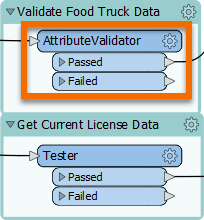

<head><base target="_blank"> </head>

#### 1. Examine the Excel Writer

Find the "Create a Report in Excel" bookmark (on the bottom-right of the Canvas); it contains a writer feature type called AffectedVendors.

#### 2. View Connection Between Reader and Writer Feature Types

Observe that there is a dark black connection line going from the output port on the food vendors CSV reader feature type to the input port on the Excel writer feature type. This connection line tells FME to write data to this writer feature type.

#### 3. Run the Workspace

Click the Run button to run the workspace and convert your CSV to Excel.

#### 4. View the Written Data

After `Translation was SUCCESSFUL` appears as the last line in your Translation Log, the workspace has finished running.

To confirm the Excel file was written, click the AffectedVendors writer feature type once to select it.

Then click the Open Containing folder icon that appears on the small toolbar above the feature type.

The location of the new AffectedVendors.xlsx file will appear in a new Windows Explorer window. To inspect the written data, you can double-click it, and click Next through the prompts. Eventually Open Office will open the written file.

#### 5. Find AttributeValidator

Find the AttributeValidator in the "Validate Food Truck Data" bookmark to the right of the reader feature types. Note that it uses the food vendor data as its input.

#### 6. View AttributeValidator Parameters

Double-click the AttributeValidator to view its parameters in a dialog.

Like the rest of the transformers in this workspace, it is already configured. This transformer tests features to ensure each has a unique value for `KEY` and has a value for `BUSINESS_NAME`. Click Cancel to close the dialog without making changes.

#### 7. Observe Streams in Data

You should notice that the feature counts show how the data has been split into two streams by the AttributeValidator. 16 features come out of the Failed port (they did not meet the validation rules), while 75 come out of the Passed port and continue on to be written.

#### 8. Continue to Next Exercise

Click the Next button below.

