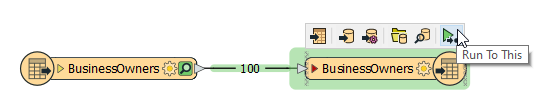

<head><base target="_blank"> </head>

#### 1. Follow Sven's Steps
Continue with the previous exercise's workspace or open C:\FMEData2022\Workspaces\IntegrateDataWithTheFMEPlatform\write-data-and-basic-troubleshooting.fmw

Make sure you have followed along with [Sven’s steps](https://safe.my.trailhead.com/content/safe/modules/connect-to-data/write-data-basic-troubleshooting).

#### 2. Run the Workspace
Be sure to run the workspace again by clicking on the "Run to this" icon on the writer feature type, and check that no errors were reported in the **Translation Log**.

#### 3. Challenge
Complete the [Challenge](https://safe.my.trailhead.com/content/safe/modules/connect-to-data/write-data-basic-troubleshooting#challenge).

#### 4. Click "Next"
