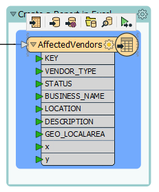
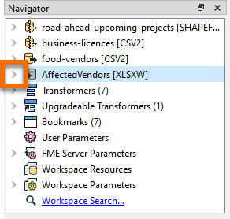
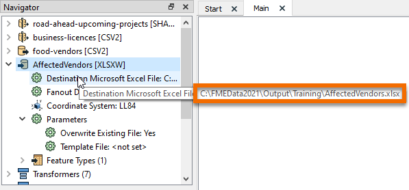
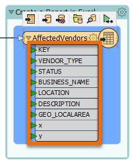
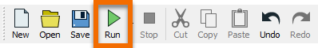
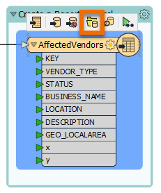

**Step 1**

Find the "Create a Report in Excel" bookmark (on the bottom-right of the Canvas); it contains a writer feature type called AffectedVendors.

Click it once to select it.

**Step 2**

When you select it, its writer in the Navigator window will also be highlighted in gray: AffectedVendors [XLSXW].

Click the right-pointing arrow next to the writer in the Navigator to expand its parameters.

The Destination Microsoft Excel File parameter tells us this writer will create data at `C:\\FMEData2021\\Output\\Training\\AffectedVendors.xlsx`.

**Step 3**

Observe that there is a line connecting the food vendors CSV reader feature type to the Excel writer feature type. This tells FME to write out this data.

You can see the attributes (column names) listed below the writer feature type (`KEY`, `VENDOR_TYPE`, etc.).

**Step 4**

Click the Run button to run the workspace and convert your CSV to Excel.

**Step 6**

After `Translation was SUCCESSFUL` appears as the last line in your Translation Log, the workspace has finished running.

To confirm the Excel file was written, click the AffectedVendors writer feature type once to select it.

Then click the Open Containing folder icon that appears on the small toolbar above the feature type.

The location of the new AffectedVendors.xlsx file will appear in a new Windows Explorer window. To inspect the written data, you can double-click it, and click Next through the prompts. Eventually Open Office will open the written file.

**Step 7**

Click the Next button below.
